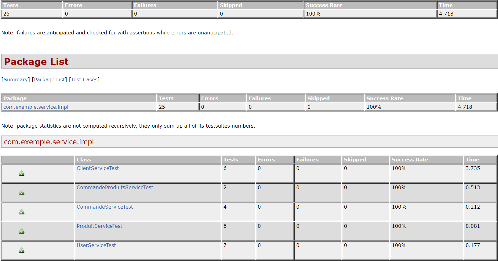

# JUnit-Jenkins-OrderCraft
Configuration Spring MVC :
Configuration du fichier web.xml et les class java @Configuration et @Bean:

Définir le DispatcherServlet comme servlet principal pour gérer les requêtes.
Configurer spring data jpa et spring mvc  les class java et beans (ou annotations) :

Configurer la numérisation des composants, Thymeleaf.
Entités Spring Data JPA :
Classe User :

Ajouter l'annotation @Entity à la classe User.
Ajouter les annotations @Id et @GeneratedValue pour l'ID.
Ajouter les annotations @ManyToOne et @JoinColumn pour les associations.
Classe Produit :

Ajouter l'annotation @Entity à la classe Produit.
Ajouter les annotations @Id et @GeneratedValue pour l'ID.
Ajouter les annotations @OneToMany pour représenter la relation avec les commandes.
Enumération Etat :

Définir l'énumération Etat avec les différents états possibles.
Classe CommandeProduit :

Ajouter l'annotation @Entity à la classe CommandeProduit.
Ajouter les annotations @Id et @GeneratedValue pour l'ID.
Ajouter les annotations @ManyToOne et @JoinColumn pour les associations.
Classe Commande :

Ajouter l'annotation @Entity à la classe Commande.
Ajouter les annotations @Id et @GeneratedValue pour l'ID.
Ajouter les annotations @ManyToOne et @JoinColumn pour les associations.
Classe Client :

Ajouter l'annotation @Entity à la classe Client.
Ajouter les annotations @Id et @GeneratedValue pour l'ID.
Ajouter les annotations @OneToMany pour représenter la relation avec les commandes.
Interfaces Repository Spring Data JPA :
UserRepository :

Créer une interface UserRepository étendant JpaRepository.
ProduitRepository :

Créer une interface ProduitRepository étendant JpaRepository.
CommandeProduitRepository :

Créer une interface CommandeProduitRepository étendant JpaRepository.
CommandeRepository :

Créer une interface CommandeRepository étendant JpaRepository.
ClientRepository :

Créer une interface ClientRepository étendant JpaRepository.
Contrôleur Spring MVC :
Classe UserController :

Ajouter des méthodes pour afficher le formulaire utilisateur, ajouter, supprimer, afficher le formulaire d'édition, mettre à jour et lister les utilisateurs.
Classe ProduitController :

Ajouter des méthodes pour afficher les produits, ajouter un produit, supprimer un produit et afficher les détails du produit.
Classe CommandeController :

Ajouter des méthodes pour afficher les commandes, ajouter une commande, afficher les détails de la commande et mettre à jour l'état de la commande.
Classe ThymeleafController :

Ajouter des méthodes pour afficher les pages Thymeleaf.
Vues Thymeleaf :
users.html :

Créer une page Thymeleaf pour afficher le formulaire utilisateur.
produits.html :

Créer une page Thymeleaf pour afficher la liste des produits.
commandes.html :

Créer une page Thymeleaf pour afficher la liste des commandes.

etc.............

Digramme class:

Diagrame cas d'utilisation:

## Test unitaire pour tout les class service :

## Test pour class ClientServiceTest :

## Test pour class CommandeProduittServiceTest :

## Test pour class CommandeServiceTest :

## Test pour class ProduitServiceTest :

## Test pour class UserServiceTest :

